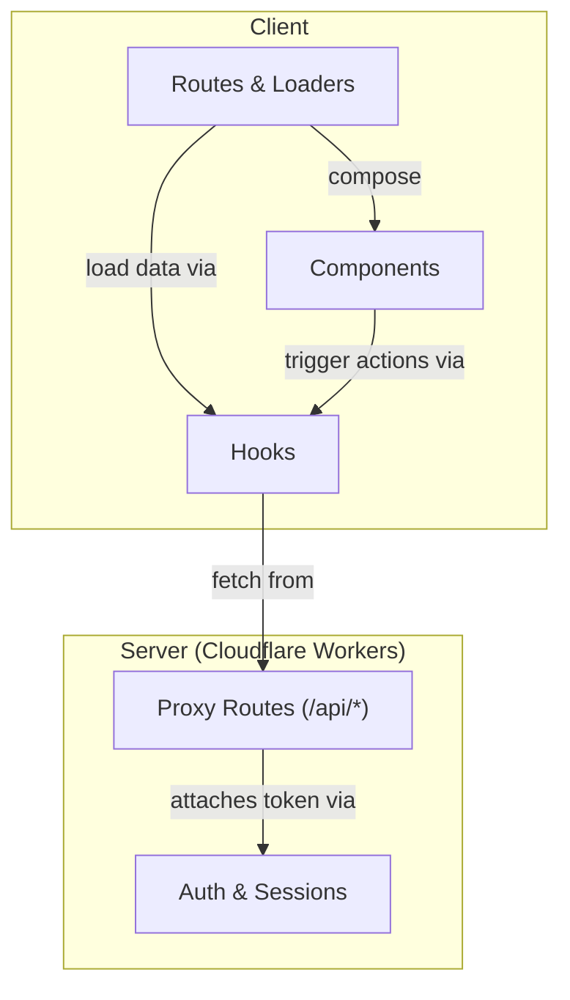
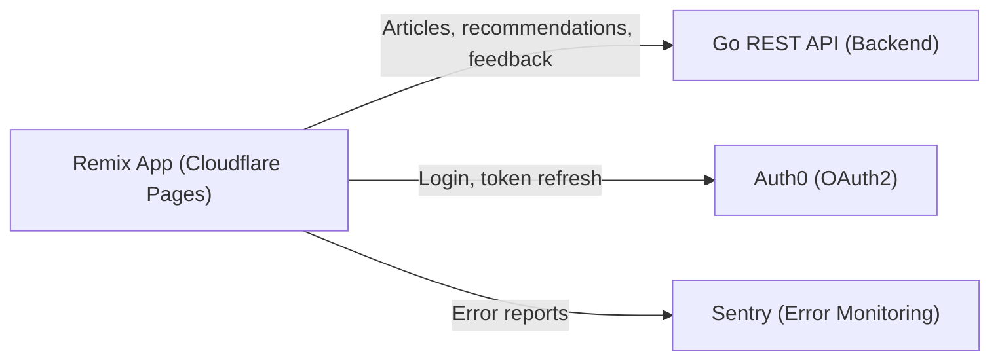
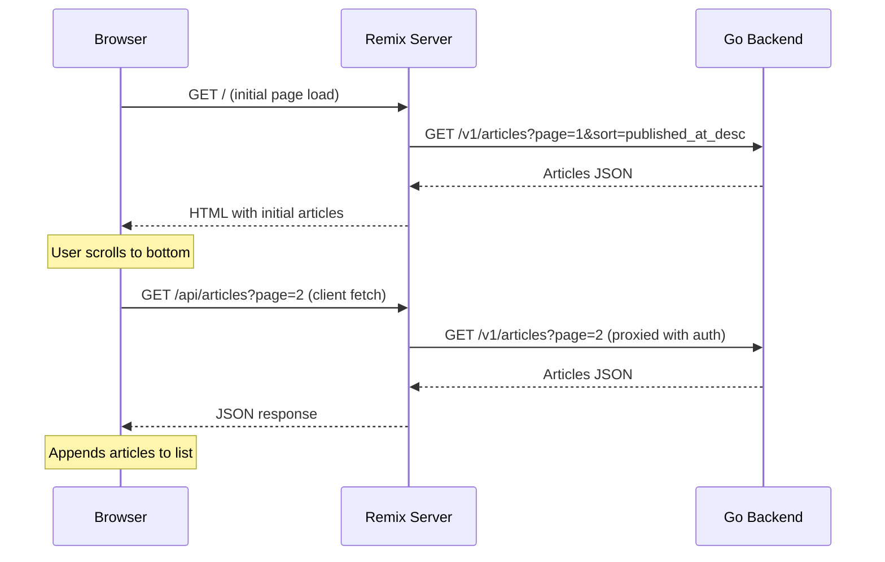
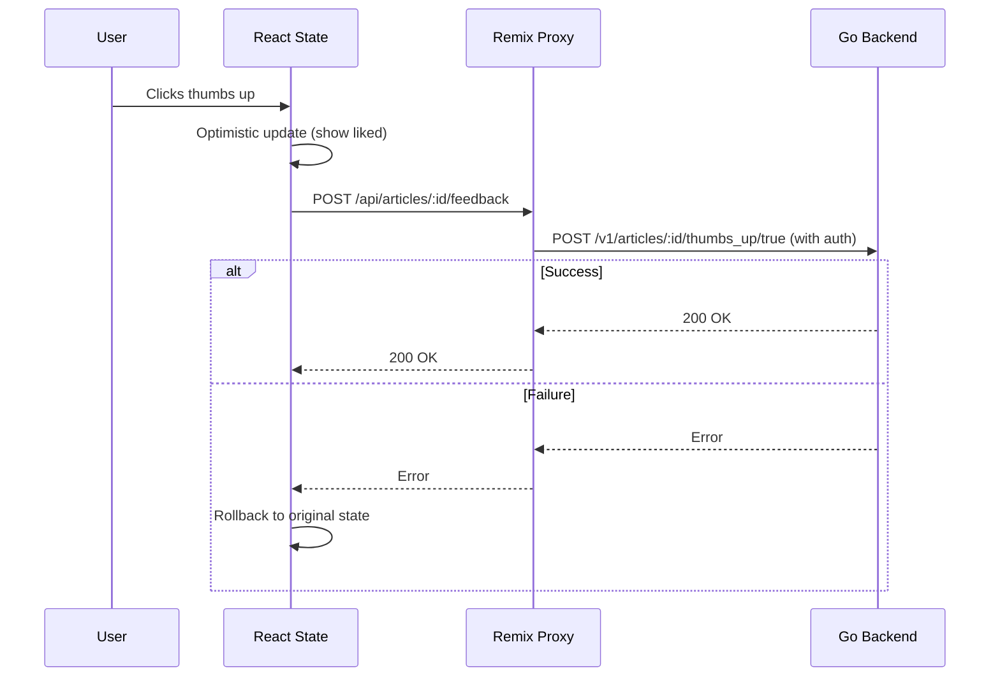
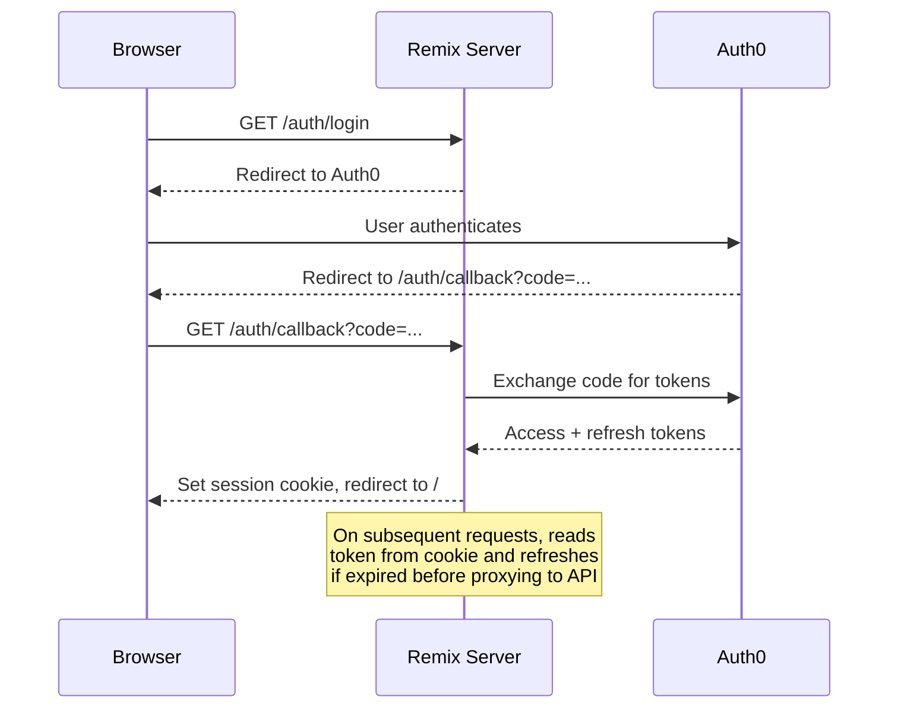

# Alignment Research Feed Frontend

A React/Remix web application for browsing, searching, and discovering AI Alignment research articles. It aggregates content from dozens of research sources into a unified feed with personalized recommendations, full-text search, semantic search, and user feedback. The app runs on Cloudflare Pages and communicates with a Go REST API backend that manages the article database and recommendation engine.

## Key Concepts

- **Article** -- A research publication with metadata (title, authors, source, publication date), a text excerpt, and optional LLM-generated analysis (summary, key points, implication, category). Each article also carries per-user interaction state: `have_read`, `thumbs_up`, `thumbs_down`.

- **View Modes** -- The feed supports two display modes, `list` (compact rows) and `grid` (cards with thumbnails), persisted to `localStorage` via the `useViewPreference` hook.

- **User Feedback** -- Authenticated users can like, dislike, or mark articles as read. Feedback uses **optimistic updates**: the UI reflects changes instantly, then sends the request to the backend. On failure, the UI rolls back to the original state.

- **Proxy Routes** -- Client-side fetches go through Remix proxy routes (`/api/articles/*`) rather than calling the backend directly. The proxy attaches the user's auth token server-side, avoiding CORS issues and keeping tokens off the client.

- **Personalized Content** -- Authenticated users see additional tabs: Recommended (ML-based suggestions from Pinecone), Unreviewed, Liked, and Disliked. The Recommended page uses Remix deferred loading with Suspense to stream results.

- **Semantic Search** -- Users can describe a research topic in natural language and find related articles via vector similarity search.

## Architecture Overview

The application follows a layered Remix architecture: routes handle data loading and page composition, components handle presentation, hooks encapsulate data fetching and state management, and a server layer manages authentication and API communication.



## External Dependencies

The frontend depends on three external services. Auth0 and Sentry are optional -- the app works without them, though authentication and error monitoring will be disabled.



## Data Flow

### Article Browsing

The primary flow: a user loads the main feed, and subsequent pages load via infinite scroll.



### User Feedback (Optimistic Updates)

When a user likes or dislikes an article, the UI updates instantly and rolls back on failure.



### Authentication

Authentication uses Auth0 OAuth2 with server-side session cookies. Tokens are stored in an encrypted cookie and refreshed automatically when expired.



## Getting Started

### Prerequisites

- Node.js >= 20.0.0
- Access to the Go backend API (see [alignment-research-feed](../alignment-research-feed/))

### Install Dependencies

```sh
npm install
```

### Configure Environment

Copy the example environment file and populate the Auth0 client secret:

```sh
cp .dev.vars.example .dev.vars
```

Required variables in `.dev.vars`:

| Variable                     | Description                                |
| ---------------------------- | ------------------------------------------ |
| `ALIGNMENT_FEED_BASE_URL`    | Backend API URL                            |
| `AUTH_SESSION_SECRET`        | Secret for encrypting session cookies      |
| `AUTH0_DOMAIN`               | Auth0 tenant domain                        |
| `AUTH0_CLIENT_ID`            | Auth0 application client ID                |
| `AUTH0_CLIENT_SECRET`        | Auth0 application client secret            |
| `AUTH0_DEFAULT_REDIRECT_URI` | URL to redirect to after login             |
| `AUTH0_AUDIENCE`             | Auth0 API audience identifier              |
| `SENTRY_DSN`                 | Sentry DSN for error monitoring (optional) |

### Run Development Server

```sh
npm run dev
```

To run with Wrangler (production-like Cloudflare Workers environment):

```sh
npm run build
npm run start
```

### Code Quality

Check formatting, lint, and type errors:

```sh
npm run format:check
npm run lint
npm run typecheck
```

Auto-format all files:

```sh
npm run format
```

Run tests:

```sh
npm run test:run
```

### Deploy

Build and deploy to Cloudflare Pages:

```sh
npm run deploy
```

## Proxy API Reference

The frontend does not call the backend API directly from the browser. Instead, all client-side fetches go through Remix proxy routes that attach authentication headers server-side. These routes live in `app/routes/api.*.tsx`.

| Proxy Route                     | Method    | Backend Endpoint                    | Purpose                                 |
| ------------------------------- | --------- | ----------------------------------- | --------------------------------------- |
| `/api/articles`                 | GET       | `/v1/articles`                      | Paginated article list with search/sort |
| `/api/articles/:id/similar`     | GET       | `/v1/articles/:id/similar`          | Similar articles                        |
| `/api/articles/:id/feedback`    | POST      | `/v1/articles/:id/{action}/{value}` | Thumbs up/down, mark as read            |
| `/api/articles/recommended`     | GET       | `/v1/articles/recommended`          | Personalized recommendations            |
| `/api/articles/liked`           | GET       | `/v1/articles/liked`                | User's liked articles                   |
| `/api/articles/disliked`        | GET       | `/v1/articles/disliked`             | User's disliked articles                |
| `/api/articles/unreviewed`      | GET       | `/v1/articles/unreviewed`           | User's unreviewed articles              |
| `/api/articles/semantic-search` | POST      | `/v1/articles/semantic-search`      | Vector similarity search                |
| `/api/tokens`                   | GET, POST | `/v1/tokens`                        | List and create API tokens              |
| `/api/tokens/:id`               | DELETE    | `/v1/tokens/:id`                    | Delete an API token                     |

For full API documentation, see the [alignment-research-feed](../alignment-research-feed/) backend repository.
